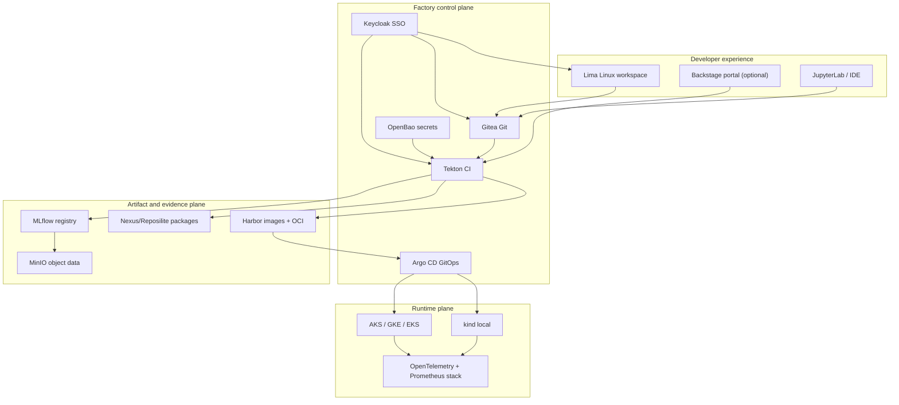

# AI Software Factory Architecture and Decision Guide

## 1. Outcome

The software factory gives each developer a prepared Linux workspace, trusted package sources, repeatable build templates, shared test evidence, model lineage, and controlled promotion to Kubernetes. It favors a small core and optional capabilities over a single giant platform.

### Goals

- Build and test Java, C/C++, Python, Go, Rust, web applications, containers, and AI models.
- Work on a Mac while matching the Linux build environment used in CI.
- Keep source, test results, model versions, packages, images, SBOMs, and deployment history traceable.
- Use one sign-on, group-based access, short-lived cloud identity, and auditable changes.
- Run the same workload contract on local `kind`, AKS, GKE, and EKS.
- Roll back by digest and Git commit without rebuilding.
- Let teams extend pipelines without granting them control of the shared factory.

### Non-goals for the starter

- A turnkey regulated-production landing zone.
- One-click installation of every optional tool on a laptop.
- Training large foundation models on a Mac.
- Making cloud-specific storage, GPU, load balancer, or identity behavior identical.

## 2. The factory analogy

| Factory concept | Platform equivalent |
|---|---|
| Factory floor | Linux VM, containers, Kubernetes, networks, storage |
| Tool crib | Package repositories, base images, compiler images, templates |
| Blueprint | Source repository, model card, pipeline definition, deployment manifest |
| Assembly line | Tekton pipeline stages |
| Quality station | Unit, integration, security, AI evaluation, and policy tests |
| Warehouse | Harbor, package repository, MinIO, MLflow registry |
| Shipping manifest | GitOps environment repository |
| Badge office | Keycloak SSO and role/group mappings |
| Safety office | Policy engine, signing, SBOM, vulnerability and secret scanning |
| Maintenance log | Git, audit events, metrics, logs, traces, incident records |

## 3. Logical architecture

Keep the control plane separate from workload namespaces. A broken experiment must not take down Git, identity, the registry, or deployment reconciliation. At enterprise scale, run core services in a dedicated platform cluster and production workloads in separate clusters/accounts.

## 4. Recommended open-source tool set

| Capability | Default | Alternatives | Why / tradeoff |
|---|---|---|---|
| Source control | Gitea | Forgejo, GitLab CE | Gitea is small and easy. GitLab has deeper built-in workflows but needs more resources and is open-core. |
| SSO | Keycloak | Authentik, Dex | Mature OIDC/SAML and federation. Keycloak needs database care and upgrade testing. |
| CI pipeline | Tekton | Woodpecker, Jenkins | Kubernetes-native, reusable Tasks, strong provenance path. More YAML and cluster concepts than Woodpecker. |
| GitOps CD | Argo CD | Flux | Excellent UI and app model. Protect admin and ApplicationSet privileges. |
| Container/OCI registry | Harbor | CNCF Distribution | Harbor adds scanning, replication, retention, signing integrations, and RBAC; it is heavier. |
| Language packages | Nexus Repository OSS | Reposilite, Pulp, native registries | Nexus covers many ecosystems; support depth and edition features vary by format. Use proxy allowlists. |
| Experiment/model tracking | MLflow | Kubeflow metadata | Broad adoption and simple start. Registry governance and HA need deliberate design. |
| Object storage | MinIO | Ceph, cloud object storage | S3-compatible and portable. Production erasure coding, TLS, backup, and licensing review matter. |
| Secrets | OpenBao | External Secrets plus cloud secret manager, SOPS | Truly open source and centralized. It is a critical stateful service; unseal, backup, and HA are real work. |
| Policy | Kyverno | OPA Gatekeeper | Kubernetes-friendly policies and reports. Start audit-only, then enforce. |
| Image build | BuildKit | Podman/Buildah, Kaniko | Fast, rootless-capable builds. Avoid privileged Docker-in-Docker. |
| SBOM/signing | Syft + Cosign | Trivy SBOM, Notation | Open formats and keyless signing options. Verification policy is as important as signing. |
| Vulnerability scan | Trivy + Grype | Clair | Good coverage, but scanners disagree and databases can be stale. Define severity and exception policy. |
| Static/security tests | Semgrep CE, Gitleaks, ZAP | CodeQL where licensed, language linters | Useful defaults; no scanner proves software safe. Tune rules to control false positives. |
| AI evaluation | pytest + promptfoo + Giskard OSS | Deepchecks, custom harness | Tests quality, attacks, robustness, and regression. Metrics and data must be project-specific. |
| Observability | OpenTelemetry, Prometheus, Grafana, Loki, Tempo | VictoriaMetrics | Open standards and broad support. Set retention and label-cardinality limits early. |
| Developer portal | Backstage, optional | Port, custom UI | Great catalog and templates at scale; too much overhead for a small team. Start with README/templates. |
| Dev workspace | Lima VM + Ansible | Dev Containers, Coder/Code-Server | Lima is friendly on macOS; remote workspaces improve isolation but require a service. |
| IaC | OpenTofu | Terraform | OpenTofu is open source and Terraform-compatible. Terraform uses a source-available BUSL license for current releases. |

### Language toolchains

| Stack | Build | Unit/quality | Integration/web |
|---|---|---|---|
| Java | Maven or Gradle | JUnit 5, SpotBugs, Checkstyle, JaCoCo | Testcontainers, REST Assured |
| C/C++ | CMake + Ninja, GCC/Clang | Catch2 or GoogleTest, clang-tidy, sanitizers | Testcontainers or Compose fixtures |
| Python/AI | uv/pip, wheel | pytest, Ruff, mypy, coverage, hypothesis | MLflow, promptfoo/Giskard, Testcontainers |
| Go | Go modules | `go test`, govulncheck, staticcheck, golangci-lint | Testcontainers-Go |
| Rust | Cargo | `cargo test`, Clippy, rustfmt, cargo-audit | testcontainers-rs |
| Web | pnpm/npm | Vitest, ESLint, axe | Playwright; Cypress is an alternative |

Pin toolchain images by digest and dependency lockfiles. The VM provides common tools, while builds run in versioned containers so a golden-image update does not silently change old pipelines.

## 5. End-to-end flow

1. **Request a workspace.** Platform automation creates a Linux VM from a golden definition and maps the developer's Keycloak groups.
2. **Pull only trusted dependencies.** Maven, npm, Python, Go, Cargo, APT, and container clients use approved proxy repositories. Quarantine new packages if policy requires it.
3. **Create from a template.** A service or model repository starts with owners, build file, test policy, SBOM/signing steps, model card, and deployment base.
4. **Develop locally.** The same test commands run in the VM and CI containers. No long-lived cloud keys are copied into the VM.
5. **Review a change.** Protected branches require peer review, passing checks, and signed commits/tags where appropriate.
6. **Build once.** CI resolves locked dependencies, compiles, tests, scans, produces an SBOM and provenance, signs the artifact, and pushes it under an immutable digest.
7. **Record model evidence.** Dataset snapshot ID, code commit, parameters, metrics, evaluation thresholds, approval, and model artifact are linked in MLflow/object storage.
8. **Deploy to test.** CI proposes a change to the environment Git repository. Argo CD deploys the exact digest.
9. **Promote, do not rebuild.** Approval changes the desired digest for staging and production. Policy verifies signature, SBOM, and required evidence.
10. **Observe.** OpenTelemetry connects metrics, logs, traces, model quality, drift, latency, token/cost use, and deployment metadata.
11. **Roll back.** Revert the GitOps commit or select the previous known-good digest. Database/schema changes require expand-contract design and a separate recovery plan.

## 6. AI-specific test gates

Traditional application gates remain mandatory. Add these model gates:

| Gate | Example evidence | Common gotcha |
|---|---|---|
| Data contract | schema, ranges, null rates, source/version | Training-serving skew hides behind compatible schemas. |
| Reproducibility | commit, data snapshot, seed, environment, parameters | GPU operations and external APIs may be nondeterministic. |
| Quality | accuracy/F1/recall or task rubric vs baseline | A single aggregate metric hides subgroup failures. |
| Robustness | corrupted inputs, edge cases, distribution shifts | Test data can leak into training or prompt tuning. |
| Safety/security | prompt injection, tool misuse, output handling, model-file scanning | Treat model files and prompts as untrusted input. |
| Fairness/privacy | subgroup metrics, PII checks, memorization tests | Legal and ethical thresholds require owners, not tool defaults. |
| Operations | p95 latency, memory/GPU, failure mode, cost budget | A better model may be operationally worse. |
| Human approval | model card, risk tier, owner acceptance | Automation cannot accept business risk for a person. |

Use risk tiers. A spelling helper and an autonomous financial action agent should not share the same approval path.

## 7. Access model

### Human identity

- Keycloak is the identity broker; connect it to the organization's authoritative directory and MFA.
- Map directory groups to platform roles; never assign most permissions user by user.
- Use OIDC Authorization Code flow with PKCE. Tools without OIDC sit behind an OIDC-aware proxy.
- Separate `developer`, `maintainer`, `security-reviewer`, `release-approver`, `platform-admin`, and `auditor` roles.
- Use time-limited elevation and log every admin action.

### Workload identity

- Use Kubernetes service accounts plus cloud workload identity: AKS Workload Identity, GKE Workload Identity Federation, and EKS Pod Identity/IRSA.
- Do not place cloud access keys in Kubernetes Secrets, Git, images, or VM dotfiles.
- OpenBao issues short-lived credentials for internal systems. External Secrets may copy or synchronize values where an application cannot fetch them directly.

### Recommended role boundaries

| Role | Allowed | Not allowed |
|---|---|---|
| Developer | create branch, run own pipelines, view non-sensitive logs, deploy ephemeral/test | production approval, policy bypass, platform admin |
| Maintainer | merge protected repository changes, own component, approve staging | change security policy, direct production mutation |
| Release approver | approve production GitOps change | alter build evidence after approval |
| Security reviewer | manage policies/exceptions, inspect evidence | routinely build application code |
| Platform admin | operate shared services and clusters | self-approve application releases |
| Auditor | read evidence and audit history | mutate resources |

## 8. Design patterns

1. **Paved road, not a prison.** A small set of supported templates handles most projects. Exceptions have an owner and expiration date.
2. **Ports and adapters.** Pipeline contracts say “source, artifact, evidence, deploy” while adapters implement Harbor, MLflow, or a cloud provider.
3. **GitOps reconciliation.** Git records desired state; controllers converge the cluster. Emergency changes must be back-ported immediately.
4. **Build once, promote by digest.** Never rebuild for each environment.
5. **Immutable evidence envelope.** Bind commit, artifact digest, SBOM, provenance, tests, signature, model/data versions, and approvals.
6. **Control-plane/data-plane separation.** Shared factory tools and user workloads fail and scale independently.
7. **Namespace tenancy.** Apply quotas, limits, network policies, pod security, service accounts, and ownership labels per team/environment.
8. **Expand-contract changes.** Database and API changes remain compatible during rollout and rollback.
9. **Policy as code.** Version admission, dependency, retention, and approval rules; test policies before enforcement.
10. **Golden VM plus hermetic builds.** The VM improves experience; containerized, pinned builds provide reproducibility.
11. **Replaceable stateful services.** Back up data and configuration, test restore, and avoid hidden state on worker nodes.
12. **Small blast radius.** Separate production accounts/projects/subscriptions and clusters from development.

## 9. Deployment options

| Option | Best for | Pros | Cons / gotchas |
|---|---|---|---|
| Python simulator | agreeing on workflow | seconds to run, no dependencies | no real SSO, CI, persistence, or cluster actions |
| Docker/Podman Compose | one developer or demo | simple, portable, inspectable | laptop capacity, weak HA, networking differs from K8s |
| `kind` on Mac | manifest and pipeline learning | realistic Kubernetes API, cheap, disposable | no cloud IAM/LB/storage behavior; CPU/RAM intensive |
| One shared managed cluster | small team/non-prod | lower cost and simpler ops | larger blast radius; noisy neighbors; platform upgrades affect workloads |
| Platform cluster + workload clusters | production teams | stronger isolation and lifecycle control | more networking, GitOps, cost, and operational work |
| Kubeflow suite | many ML teams and complex workflows | notebooks, pipelines, training operators, metadata | heavy, complex upgrades, overlapping components; avoid as phase one |

### Cloud comparison

| Area | AKS | GKE | EKS |
|---|---|---|---|
| Human/cloud SSO | Microsoft Entra integration | Google IAM | AWS IAM / Identity Center |
| Pod identity | AKS Workload Identity | Workload Identity Federation for GKE | EKS Pod Identity or IRSA |
| Registry | ACR | Artifact Registry | ECR |
| Managed secrets option | Key Vault | Secret Manager | Secrets Manager / Parameter Store |
| Main gotcha | subscription/RBAC plus Entra layers | IAM plus Kubernetes RBAC and project boundaries | IAM, cluster access entries, VPC/CNI/IP capacity |

Use cloud-managed storage and identity through adapters where it meaningfully reduces operational risk. “Portable” should mean a common workload and evidence contract, not refusing every managed capability.

## 10. Security and supply-chain baseline

- Private cluster API and private worker nodes for production; connect through approved VPN/bastion/zero-trust access.
- Kubernetes Pod Security `restricted`, non-root containers, read-only filesystems, dropped capabilities, seccomp, and resource limits.
- Default-deny ingress and egress NetworkPolicies; explicitly allow DNS and named dependencies.
- Admission verifies signed images, approved registries, immutable digests, required labels, and prohibited privilege settings.
- Isolate untrusted pull-request builds from credentialed release builds. Do not expose secrets to forked code.
- Generate CycloneDX or SPDX SBOMs; attach provenance; scan source, dependencies, images, IaC, secrets, and licenses.
- Mirror and allowlist dependencies; set retention and quarantine policies. Avoid `latest` tags.
- Encrypt in transit and at rest. Back up Keycloak DB, Git, Harbor, package repos, MLflow DB, object storage, OpenBao, and GitOps repositories.
- Send audit logs to an append-only destination outside the cluster.
- Patch base images on a cadence and trigger rebuilds; never silently mutate an existing version.

## 11. Reliability and rollback

### Rollback ladder

1. Pause promotion and capture evidence.
2. Disable risky feature/model route if a switch exists.
3. Shift traffic to previous model/service revision.
4. Revert the GitOps commit to the last signed digest.
5. Roll back application deployment only if data/schema remains compatible.
6. Restore data only through the tested recovery procedure; never as the first response.

Canary or blue/green deployment requires a traffic manager such as Argo Rollouts plus gateway/mesh integration. Plain Kubernetes `Deployment` supports rolling updates but not metric-driven promotion.

### Recovery targets to define

- RPO: acceptable amount of data/evidence loss.
- RTO: acceptable time to restore the factory or a workload.
- Artifact retention: how long an exact image/model/package remains available.
- Evidence retention: how long tests, approvals, logs, and SBOMs remain auditable.

Test restore at least quarterly. A successful backup job is not proof that recovery works.

## 12. Major gotchas

1. **Architecture mismatch on Apple Silicon.** Build multi-architecture images with BuildKit and test `linux/amd64` if production nodes are x86_64.
2. **Laptop resource pressure.** Keycloak, Harbor, Tekton, Argo CD, MLflow, observability, and scanners together can exceed normal Mac memory. Install in phases.
3. **Kubernetes is not the portability layer for everything.** Load balancers, persistent volumes, GPUs, identity, DNS, and autoscaling differ by cloud.
4. **NetworkPolicy needs a supporting CNI.** A manifest alone does not guarantee enforcement.
5. **Default-deny egress breaks DNS, package downloads, OIDC, and telemetry.** Add explicit destinations and test renewals.
6. **Rollback can fail after destructive schema or feature changes.** Use expand-contract and forward-fix plans.
7. **Mutable tags destroy evidence.** Deploy digests and retain the registry data.
8. **Package proxy is a supply-chain boundary.** Cache poisoning, name confusion, licenses, and deleted upstream versions need policy.
9. **SSO is not authorization.** Each tool needs correct group/role mapping and periodic access review.
10. **CI runners execute hostile code.** Use ephemeral workers, separate trust zones, minimal service accounts, no privileged Docker socket.
11. **Model registry is not a full approval system.** Bind model version to code, data, evaluations, risk owner, and deployment.
12. **GPU workloads add device plugins, drivers, node pools, quotas, and expensive idle capacity.** Start CPU-only unless the use case proves otherwise.
13. **Open-source licensing changes.** Record approved versions/licenses; OpenTofu is the strict-OSS IaC default here while remaining Terraform-compatible.
14. **Tool sprawl creates an integration tax.** Every new UI needs SSO, backup, patching, monitoring, and an owner.

## 13. Phased implementation

### Phase 0 — workflow simulator

- Run this project locally.
- Agree on artifact/evidence IDs, roles, environments, test gates, exception process, and rollback owner.
- Exit criterion: one simulated component can move from commit through rollback with an audit trail.

### Phase 1 — developer floor

- Lima/Ansible workspace, trusted package proxies, Gitea, Keycloak, and one Python pipeline.
- Add Java/C++/Go/Rust/web profiles only as teams need them.
- Exit criterion: a new developer reproduces the build in under one hour without a shared admin password.

### Phase 2 — trusted delivery

- Tekton ephemeral tasks, Harbor, SBOM/signing, scans, Argo CD, and a non-production managed cluster.
- Exit criterion: staging accepts only signed, policy-compliant digests and rollback is rehearsed.

### Phase 3 — model lifecycle

- MLflow, object-store snapshots, model cards, AI evaluations, and workload observability.
- Exit criterion: every deployed model maps to code, data, metrics, risk approval, and owner.

### Phase 4 — production and scale

- Separate production boundary, HA/backup/restore, SLOs, quotas, cost controls, disaster recovery, and optional Backstage/Kubeflow.
- Exit criterion: recovery and access-review exercises meet agreed RPO/RTO and audit requirements.

## 14. Decision checklist

Before implementation, answer:

- Which directory is authoritative for identity and MFA?
- Which teams and data classifications may share a cluster?
- What makes an AI model releasable, and who accepts residual risk?
- Must builds work without internet access? If yes, which mirrors and update process are required?
- Which CPU architectures and GPU types are production targets?
- What are RPO, RTO, retention, and regional availability requirements?
- Which cloud is first? Multi-cloud scaffolding should not become three simultaneous production programs.
- Which components require paid support even if the software is open source?
- What is the maximum laptop and cluster budget?

Start with one cloud, one team, one Python model, and one web/service component. Prove the evidence chain and rollback path before widening the catalog.

