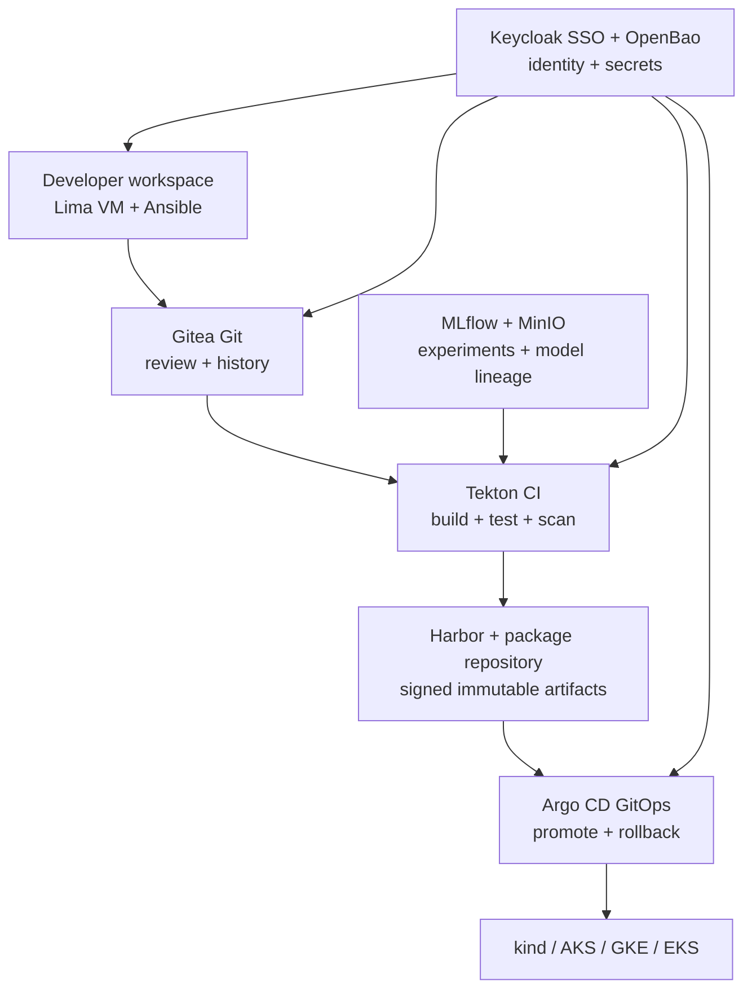
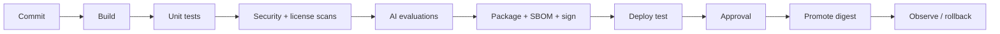

# Open AI Software Factory

A maintainable, open-source-first starter platform for building, testing, tracking, promoting, and rolling back AI models and polyglot software. It runs as a lightweight simulator on macOS, in Docker or Podman, on a local `kind` cluster, and provides deployment scaffolding for Azure AKS, Google GKE, and AWS EKS.

> Azure's managed Kubernetes service is **AKS**. EKS is the AWS service.

## What is included

- A zero-dependency Python API and offline static HTML control-panel simulator.
- A staged architecture: laptop demo, team platform, and optional advanced ML services.
- Kubernetes resources with non-root execution, health checks, resource limits, autoscaling, and default-deny network policy.
- OpenTofu/Terraform-compatible foundations for AKS, GKE, and EKS.
- Ansible configuration for a reusable Linux developer workspace.
- macOS, cloud login, deployment, test, and rollback shell scripts.
- Tekton and Argo CD examples for CI plus GitOps delivery.
- Keycloak realm bootstrap with developer, maintainer, security, and platform-admin roles.
- Minimal Java, C++, Python, Go, Rust, and web test examples.
- Architecture, options, tradeoffs, risks, and phased adoption guidance in [ARCHITECTURE.md](ARCHITECTURE.md).

## Architecture at a glance



The factory uses three separate records:

1. **Source record:** Git commit, review, owner, and change history.
2. **Artifact record:** image digest, package checksum, SBOM, signature, test evidence, model version.
3. **Deployment record:** environment manifest and exact digest currently deployed.

That separation makes rollback predictable: GitOps changes the desired deployment back to a known digest; it does not rebuild old source.

## Five-minute local simulator

Requirements: macOS or Linux, Python 3.11+.

```bash
cd ai-software-factory
./scripts/00-check-prereqs.sh
./scripts/10-local-up.sh
```

Open <http://127.0.0.1:8080>. Stop it with `Ctrl+C`.

Run tests:

```bash
./scripts/20-test.sh
```

## Run in Docker or Podman

```bash
docker compose up --build
# or
podman compose up --build
```

Open <http://127.0.0.1:8080>. The container is read-only, runs as a non-root user, and exposes only the simulator.

## Run on local Kubernetes

Docker Desktop or Colima must be running, and `kind`, `kubectl`, and `kustomize` must be installed.

```bash
./scripts/30-kind-create.sh
./scripts/31-kind-deploy.sh
kubectl -n ai-factory port-forward service/factory-simulator 8080:80
```

Then open <http://127.0.0.1:8080>.

## Linux developer workspace on macOS

The workspace is a Linux VM managed by Lima and configured by Ansible. It gives every developer the same build floor without mixing project dependencies into macOS.

```bash
brew install lima ansible
./scripts/15-workspace-create.sh
limactl shell ai-factory
```

The role installs the common compilers and build tools. Teams add project-specific dependencies in repository-controlled containers or lockfiles, not directly to the golden VM.

## Cloud deployment workflow

Choose one cloud directory; do not apply all three unless you intentionally want three clusters.

```bash
./scripts/40-cloud-login.sh aws    # aws | azure | gcp
./scripts/50-infra-plan.sh aws
./scripts/51-infra-apply.sh aws
./scripts/55-cloud-image.sh aws
# Put the pushed image (preferably its digest) in the matching Kustomize overlay.
./scripts/60-cloud-deploy.sh aws
```

Each Terraform/OpenTofu root is intentionally small. Copy its example variables file, replace placeholders, and review the plan. The scripts prefer `tofu` because OpenTofu is fully open source; they use `terraform` when OpenTofu is unavailable.

Destroying cloud infrastructure is intentionally not automated by a one-click script. Capture databases, model data, registry artifacts, DNS, and retention requirements before running `tofu destroy` or `terraform destroy` in the selected provider directory.

## Pipeline flow



The same artifact moves between test, staging, and production. Environment-specific configuration is injected at deployment time.

## Useful commands

```bash
# API health
curl -fsS http://127.0.0.1:8080/api/health

# Create a simulated pipeline run
curl -fsS -X POST http://127.0.0.1:8080/api/pipelines/run \
  -H 'Content-Type: application/json' \
  -d '{"project":"fraud-model","profile":"python-ai"}'

# Roll back a simulated deployment
curl -fsS -X POST http://127.0.0.1:8080/api/deployments/rollback \
  -H 'Content-Type: application/json' \
  -d '{"application":"fraud-model","environment":"staging"}'

# Real Kubernetes rollout history and undo
kubectl -n ai-factory rollout history deployment/factory-simulator
kubectl -n ai-factory rollout undo deployment/factory-simulator
```

## Repository map

| Path | Purpose |
|---|---|
| `app/` | Python API, HTML UI, and automated tests |
| `developer-workspace/` | Lima VM definition for macOS |
| `examples/polyglot/` | Small language-specific build/test examples |
| `infra/ansible/` | Repeatable Linux workspace configuration |
| `infra/kubernetes/` | Secure base manifests and cloud overlays |
| `infra/terraform/` | AKS, GKE, and EKS infrastructure roots |
| `platform/` | Tekton, Argo CD, and Keycloak examples |
| `scripts/` | Ordered local and cloud command-line workflows |

See [platform/README.md](platform/README.md) for the phased real-tool rollout and [platform/PACKAGE-REPOSITORIES.md](platform/PACKAGE-REPOSITORIES.md) for the trusted dependency/tool-crib design.

## Recommended adoption order

1. Run the simulator and agree on ownership, environments, evidence, and approval rules.
2. Build the Lima/Ansible developer workspace and one language pipeline.
3. Stand up Git, SSO, registry, package repository, secrets, and GitOps in a non-production cluster.
4. Add MLflow/MinIO and a small, versioned AI evaluation suite.
5. Add a second language only after the first paved road is repeatable.
6. Create a separate production cluster/account/subscription/project, then test disaster recovery and rollback.

## Important boundaries

- The HTML application is a **simulator**, not an identity, secret, or production deployment system.
- Terraform files are safe starters, not a complete organization landing zone. Production needs private networking, state locking, audit export, budgets, backups, DNS, certificates, and organization policies.
- Keycloak realm JSON contains demo users only. Never keep real passwords in Git.
- AI testing must include model-specific quality, safety, bias, privacy, robustness, prompt-injection, data-drift, and cost/latency thresholds. Generic unit tests are necessary but insufficient.

## Official references

- [Kubernetes documentation](https://kubernetes.io/docs/)
- [AKS baseline architecture](https://learn.microsoft.com/azure/architecture/reference-architectures/containers/aks/baseline-aks)
- [GKE security best practices](https://cloud.google.com/kubernetes-engine/docs/concepts/security-overview)
- [Amazon EKS best practices guide](https://docs.aws.amazon.com/eks/latest/best-practices/introduction.html)
- [SLSA supply-chain framework](https://slsa.dev/)
- [OpenSSF Scorecard](https://scorecard.dev/)
